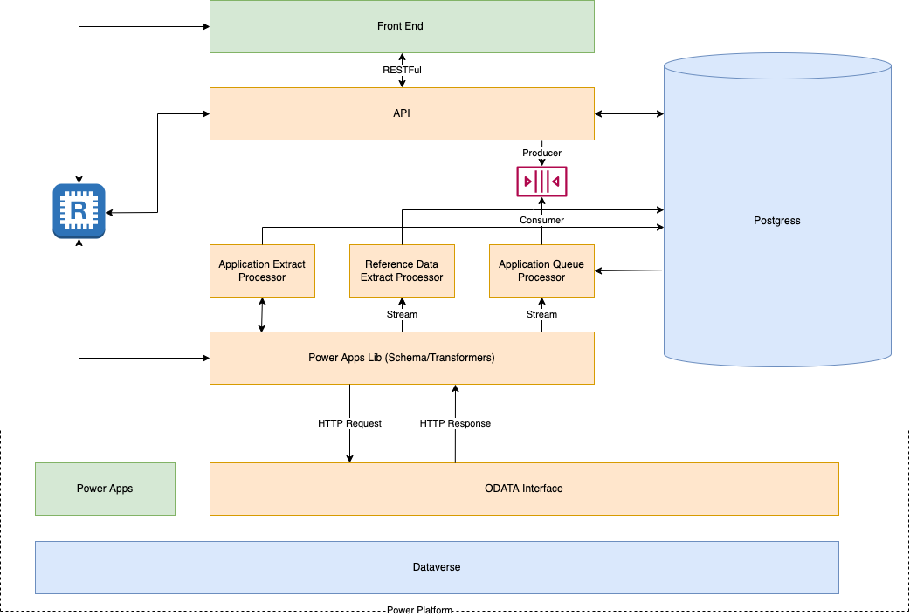

# Wildlife Licencing Services

#### For Natural England

[](http://standardjs.com)
[](https://sonarcloud.io/dashboard?id=DEFRA_wildlife-licencing)
[](https://sonarcloud.io/dashboard?id=DEFRA_wildlife-licencing)
[](https://sonarcloud.io/dashboard?id=DEFRA_wildlife-licencing)
[](https://sonarcloud.io/dashboard?id=DEFRA_wildlife-licencing)

## Getting started

### To run the application as a docker swarm

First edit the docker secret environment files to add the secret keys

- docker/env/aqp-secrets.env

(The secrets for the test environment may be obtained from <TBC - graham.willis@defra.gov.uk>)

Now run the following shell commands;

```shell
cd  wildlife-licencing
npm run docker:build
npm run docker:start
docker service ls
npm run docker:stop
```

- http://localhost:3000/openapi-ui
- http://localhost:4000/hello

The docker services running should be as follows:

- wls_adminer
- wls_db
- wls_localstack
- wls_redis
- wls_redis_commander
- wls_api
- wls_aqp

### To run locally

To run the microservices locally you need to start the supporting cloud services in the docker swarm.

Run the following shell commands;

```shell
cd  wildlife-licencing
npm run docker:start-cloud
docker service ls
```

The docker services running should be as follows:

- wls_adminer
- wls_db
- wls_localstack
- wls_redis
- wls_redis_commander

Ensure you have node version 16.13.0 or greater installed; `node --version`

#### Start the API locally

```shell
cd wildlife-licencing/packages/api
cp env.example .env
node -r dotenv/config src/api-service.js
```

#### To start the queue processor locally

```shell
cd wildlife-licencing/packages/application-queue-processor
cp env.example .env
node -r dotenv/config src/application-queue-processor.js
```

Edit the .env files to add secrets

(The secrets for the test environment may be obtained from <TBC - graham.willis@defra.gov.uk>)

Alternatively set the environment variables in the running shell or your IDE

## Packages

| Package | Description | Runnable | Docker Image |
| ----------- | ----------- | ----------- | ----------- |
| [api](packages/api) | The application program interface to support the UI and manage data transfers from the middleware to Power Platform | Y | wildlife-licencing/api |
| [application-queue-processor](packages/application-queue-processor) | Consumes jobs from the application-queue and submits them to Power Platform as ODATA batch updates. | Y | wildlife-licencing/aqp | 
| [application-extract-processor](packages/application-extract-processor) | Extracts data application data from Power Platform and updates the postgres database | Y | wildlife-licencing/ep | 
| [refdata-extract-processor](packages/refdata-extract-processor) | Extracts reference data from Power Platform and updates the postgres database | Y | wildlife-licencing/ep | 
| [web-service](packages/eps/web-service) | Public facing web server | Y | wildlife-licencing/web-service |
| [connectors-lib](packages/connectors-lib) | Encapsulates connector logic. Currently supports AWS, Postgres, Redis, Power Platform & Bull-Queue | N | 
| [database-model](packages/database-model) | Extracts the sequelize database model in order to share it between multiple processes | N | 
| [powerapps-lib](packages/powerapps-lib) | Supports operations against the Power Platform ODATA interface including transformation | N | 
| [queue-defs](packages/queue-defs) | Extracts the bull-queue queue definitions | N | 

## Application Architecture 

#### Overview


A set of API request handlers has been created for the manipulation of the application data in the POSTGRES database. These are
documented via OpenAPI at `http://localhost:3000/openapi-ui` when running locally.

Requests to the API perform SQL on the postgres tables and populate the JSON structures in the JSONB fields. 

Submitted data will be queued using bull-queue. The queues are stored in Redis and can be inspected (locally) using redis-commander `http://localhost:8002/`

The queues are defined centrally in the package ```packages/queue-defs/src/defs.js```. This enables autonomous processes
that connect to the queues on start-up to ensure they have the same definition.

The queued data is consumed by the __Application Queue Processor__ and wrtiien into the Power Platform using the powerapps-lib package.

The __Application Extract Processor__ and the __Reference Data Extract Processor__ are used to extract data from the Power Platform and write it down to the Postgres tables.

For details of the inbound and outbound processes see [powerapps-lib/README.md](packages/powerapps-lib/README.md)

