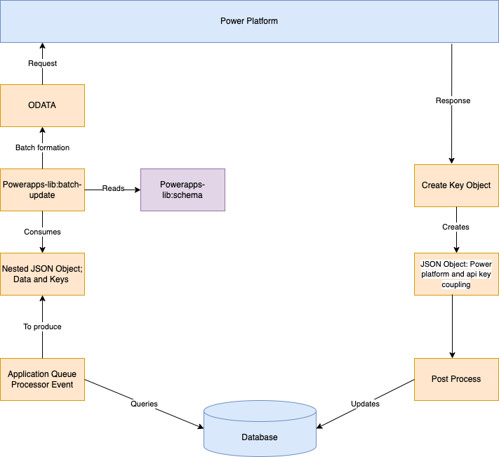
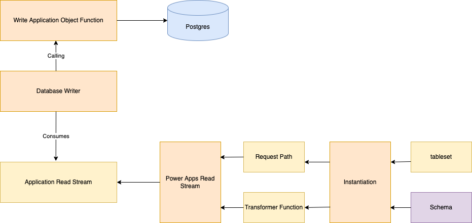

# Wildlife licencing - Powerapps lib

#### For Natural England

## Overview
### The outbound process


(1) When any service implementing the powerapps-lib is started, such as the application-queue-processor, it will initialize the schema from the set of metadata definitions described in the ``` packages/powerapps-lib/src/schema``` directory. The definition is used to instantiate a __tableset__ which is a meta-model object which maps the input data JSON structure to the target Power-Platform structure. The mapping for each data item is stored in a path variable in the __tableset__.

(2) When a job is picked up from the queue it is processed by __applicationJobProcess__ in ```packages/application-queue-processor/src/application-job-process.js```. This reads the userId and applicationId for the job and extracts the JSON data from the application, sites and application-sites tables. This is combined into two single JSON objects; a data object and a keys object. The keys object is generated if null and the known API (Postgres) keys are set. The application data and keys objects are deeply nested structures and contain JSON blocks with child data which must be written to the contacts and accounts tables on Power Platform.

An outline of the data object for an application update
```json
{
  "application": {
    "id": "",
    "applicatant": {
      "organization": {}
    },
    "ecologist": {
      "organization": {}
    },
    "sites": [
      {
        "id": ""
      }
    ]
  }
}
```

Reference data may be referred to by name, and global option sets must be addressed by their numeric identifier;
```json
{
  "application": {
    "applicationType": "A24 Badger",
    "applicationCategory": 100000001
  }
}
```

An example of the keys object for applications
```json
[
  {
    "apiKey": "8d382932-36ba-4969-84f5-380f4f6830c1",
    "apiTable": "applications",
    "apiBasePath": "application",
    "powerAppsKey": "8f75e48d-1393-ec11-b400-0022481ac7f1",
    "powerAppsTable": "sdds_applications"
  },
  {
    "apiKey": null,
    "apiTable": "applications",
    "apiBasePath": "application.applicant",
    "powerAppsKey": "8c75e48d-1393-ec11-b400-0022481ac7f1",
    "powerAppsTable": "contacts"
  },
  {
    "apiKey": null,
    "apiTable": "applications",
    "apiBasePath": "application.applicant.organization",
    "powerAppsKey": "3c390f71-2193-ec11-b400-0022481ac7f1",
    "powerAppsTable": "accounts"
  },
  {
    "apiKey": null,
    "apiTable": "applications",
    "apiBasePath": "application.ecologist",
    "powerAppsKey": "2bdfc7fa-2293-ec11-b400-0022481ac5ab",
    "powerAppsTable": "contacts"
  },
  {
    "apiKey": null,
    "apiTable": "applications",
    "apiBasePath": "application.ecologist.organization",
    "powerAppsKey": "2edfc7fa-2293-ec11-b400-0022481ac5ab",
    "powerAppsTable": "accounts"
  }
]
```

(3) The keys and data JSON objects are passed to __batchUpdate__ in ```packages/powerapps-lib/src/batch-update/batch-update.js```. This first creates a batch request handle which stores the newly generated batchId. The batch request body is then generated. The heavy lifting is done by  __createBatchRequestObjects__ in ```packages/powerapps-lib/src/schema/processors/schema-processes.js``` which creates a sequential array of objects, each representing a single operation within the batch and contains details of all the assignments, the relationship bindings, and the creation of many-to-many relationships.

(4) The response is then parsed for errors and any errors are logged. If there are no errors then the dataverse keys are retrieved from the response and are used to decorate the keys object, which is returned to the queue processor.

(5) The keys object is parsed and filtered into the sets pertaining to the applications and sites tables and written down into the database.

(6) If the batch request does not succeed then an exception will be thrown; either a recoverable error exception or an unrecoverable error exception. Recoverable errors will return a Promise.reject will will prompt the queue processor to retry. Unrecoverable errors are logged and removed from the queue by returning Promise.resolve. Request errors are classified as follows;
- 5XX are all recoverable
- 4XX are all unrecoverable except authorization errors 401 and client timeout 408
- Unexpected errors such as network errors are recoverable. Redirections (3XX are not expected)

### The inbound process
All inbound processes that follow the same pattern; inbounds exist for applications, sites, application-sites and reference data.

The following example illustrates the applications inbound process, but it is common to all inbound processes;



(1) When a service including the powerapps-lib is started the set of read-stream functions are created. When these functions are called they will open a started read-stream.

(2) The schema object is used to create a transformer function and a request path. The request path is an expansion of the schema into a nested ODATA query, and the transformer function is inserted into the stream to produce a sequence of single objects compliant with the API source data-structure.

(3) The database writer wraps the stream and a function to write the data into the database.


